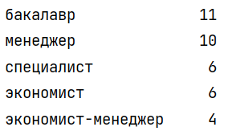

#ДЗ

**1)** У 74,25 % людей профессия и должность не совпадают: 

**2)** Топ-5 образований, с которыми становятся менеджерами: 

**3)** Топ-5 должностей людей, которые по диплому являются инженерами: 
